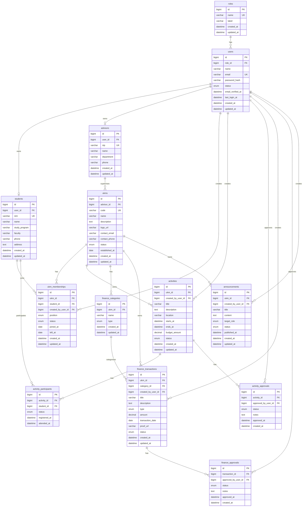

# System Design: Sistem Informasi Pengelolaan UKM

Dokumen ini berisi rancangan kebutuhan sistem, desain database, Prisma schema, SQL MySQL, dan struktur folder untuk Sistem Informasi Pengelolaan Unit Kegiatan Mahasiswa (UKM) berbasis web.

Teknologi target:

- Next.js 15
- TypeScript
- Prisma ORM
- MySQL
- Tailwind CSS
- Shadcn UI

Catatan batasan: dokumen ini tidak membuat kode halaman. Fokus hanya pada database dan arsitektur sistem.

## 1. Analisis Kebutuhan Sistem

### 1.1 Tujuan Sistem

Sistem ini digunakan untuk mengelola data Unit Kegiatan Mahasiswa, anggota, kegiatan, keuangan, dan pengumuman secara terpusat. Sistem mendukung beberapa role agar hak akses tiap pengguna sesuai dengan tanggung jawabnya.

### 1.2 Role Pengguna

| Role | Deskripsi |
| --- | --- |
| Super Admin | Pengelola seluruh sistem, semua data UKM, user, role, dan konfigurasi umum. |
| Pembina UKM | Dosen/staf pembina yang memantau UKM, kegiatan, anggota, dan laporan keuangan UKM yang dibina. |
| Pengurus UKM | Mahasiswa pengurus yang mengelola data internal UKM, anggota, kegiatan, keuangan, dan pengumuman UKM. |
| Anggota | Mahasiswa anggota UKM yang dapat melihat data UKM, kegiatan, pengumuman, dan profil keanggotaan sendiri. |

### 1.3 Modul Sistem

#### Authentication

Kebutuhan:

- Login menggunakan email dan password.
- Password disimpan dalam bentuk hash.
- Role-based access control.
- Status user aktif/nonaktif.
- Satu user dapat memiliki satu role utama.
- User dapat terhubung ke data mahasiswa atau pembina.

Data utama:

- User
- Role
- Session/account opsional jika memakai Auth.js atau NextAuth

#### Dashboard

Kebutuhan:

- Super Admin melihat ringkasan jumlah UKM, anggota, kegiatan, transaksi, dan pengumuman.
- Pembina melihat ringkasan UKM yang dibina.
- Pengurus melihat ringkasan UKM yang dikelola.
- Anggota melihat informasi keanggotaan, kegiatan aktif, dan pengumuman.

Data utama:

- Agregasi dari UKM, membership, event, finance transaction, announcement.

#### Manajemen UKM

Kebutuhan:

- CRUD data UKM.
- Menentukan pembina UKM.
- Menentukan status UKM aktif/nonaktif.
- Menyimpan informasi profil UKM.

Data utama:

- UKM
- Pembina
- UKM membership

#### Manajemen Anggota

Kebutuhan:

- CRUD data mahasiswa.
- Pendaftaran anggota UKM.
- Status keanggotaan: pending, aktif, ditolak, keluar, nonaktif.
- Jabatan anggota dalam UKM: ketua, wakil, sekretaris, bendahara, koordinator, anggota.
- Riwayat bergabung dan keluar.

Data utama:

- Student
- UKM membership

#### Manajemen Kegiatan

Kebutuhan:

- CRUD kegiatan UKM.
- Status kegiatan: draft, diajukan, disetujui, ditolak, berlangsung, selesai, dibatalkan.
- Jadwal dan lokasi kegiatan.
- Peserta kegiatan.
- Persetujuan kegiatan oleh pembina atau super admin.

Data utama:

- Activity
- Activity participant
- Activity approval

#### Manajemen Keuangan

Kebutuhan:

- Mencatat pemasukan dan pengeluaran UKM.
- Kategori transaksi keuangan.
- Bukti transaksi.
- Status transaksi: draft, diajukan, disetujui, ditolak.
- Persetujuan transaksi oleh pembina atau super admin.

Data utama:

- Finance category
- Finance transaction
- Finance approval

#### Pengumuman

Kebutuhan:

- CRUD pengumuman.
- Pengumuman dapat bersifat global atau khusus UKM.
- Target pembaca berdasarkan role atau seluruh user.
- Status publikasi: draft, published, archived.

Data utama:

- Announcement

### 1.4 Hak Akses Ringkas

| Fitur | Super Admin | Pembina UKM | Pengurus UKM | Anggota |
| --- | --- | --- | --- | --- |
| Kelola user | Ya | Tidak | Tidak | Tidak |
| Kelola semua UKM | Ya | Tidak | Tidak | Tidak |
| Lihat UKM binaan | Ya | Ya | Jika anggota/pengurus | Jika anggota |
| Kelola data UKM | Ya | Terbatas | Ya, UKM sendiri | Tidak |
| Kelola anggota | Ya | Lihat/validasi | Ya, UKM sendiri | Tidak |
| Kelola kegiatan | Ya | Validasi | Ya, UKM sendiri | Lihat/daftar |
| Kelola keuangan | Ya | Validasi | Ya, UKM sendiri | Lihat terbatas |
| Kelola pengumuman | Ya | UKM binaan | UKM sendiri | Tidak |

### 1.5 Aturan Bisnis Utama

- Setiap user wajib memiliki role.
- Satu UKM dapat memiliki satu pembina aktif.
- Satu mahasiswa dapat bergabung ke banyak UKM.
- Satu mahasiswa hanya boleh memiliki satu membership aktif pada UKM yang sama.
- Pengurus UKM adalah mahasiswa yang memiliki membership aktif dengan posisi pengurus.
- Kegiatan dan transaksi keuangan wajib terhubung ke satu UKM.
- Kegiatan dan transaksi yang membutuhkan validasi menyimpan catatan approval.
- Pengumuman dapat dibuat global tanpa UKM atau spesifik untuk satu UKM.

## 2. ERD Lengkap

ERD berikut ditulis dalam format Mermaid agar dapat dirender oleh editor Markdown yang mendukung Mermaid.



## 3. Relasi Tabel

### 3.1 Tabel dan Relasi Utama

| Tabel | Relasi |
| --- | --- |
| roles | One-to-many ke users. |
| users | Many-to-one ke roles. One-to-one opsional ke students. One-to-one opsional ke advisors. |
| students | One-to-one ke users. One-to-many ke ukm_memberships dan activity_participants. |
| advisors | One-to-one ke users. One-to-many ke ukms. |
| ukms | Many-to-one ke advisors. One-to-many ke ukm_memberships, activities, finance_categories, finance_transactions, announcements. |
| ukm_memberships | Many-to-one ke ukms, students, dan users sebagai pembuat data. |
| activities | Many-to-one ke ukms dan users sebagai pembuat data. One-to-many ke activity_participants dan activity_approvals. |
| activity_participants | Many-to-one ke activities dan students. |
| activity_approvals | Many-to-one ke activities dan users sebagai approver. |
| finance_categories | Many-to-one ke ukms. One-to-many ke finance_transactions. |
| finance_transactions | Many-to-one ke ukms, finance_categories, dan users sebagai pembuat data. One-to-many ke finance_approvals. |
| finance_approvals | Many-to-one ke finance_transactions dan users sebagai approver. |
| announcements | Many-to-one opsional ke ukms dan many-to-one ke users sebagai pembuat data. |

### 3.2 Constraint Penting

| Constraint | Tujuan |
| --- | --- |
| users.email unique | Email login tidak boleh duplikat. |
| students.nim unique | NIM mahasiswa tidak boleh duplikat. |
| advisors.nip unique | NIP pembina tidak boleh duplikat. |
| ukms.code unique | Kode UKM tidak boleh duplikat. |
| ukm_memberships unique(ukm_id, student_id) | Mencegah duplikasi membership mahasiswa pada UKM yang sama. |
| activity_participants unique(activity_id, student_id) | Mencegah peserta terdaftar dua kali pada kegiatan yang sama. |
| finance_categories unique(ukm_id, name, type) | Mencegah kategori keuangan ganda dalam UKM. |

## 4. Prisma Schema

```prisma
generator client {
  provider = "prisma-client-js"
}

datasource db {
  provider = "mysql"
  url      = env("DATABASE_URL")
}

enum UserStatus {
  ACTIVE
  INACTIVE
  SUSPENDED
}

enum UkmStatus {
  ACTIVE
  INACTIVE
}

enum MembershipPosition {
  CHAIRMAN
  VICE_CHAIRMAN
  SECRETARY
  TREASURER
  COORDINATOR
  MEMBER
}

enum MembershipStatus {
  PENDING
  ACTIVE
  REJECTED
  LEFT
  INACTIVE
}

enum ActivityStatus {
  DRAFT
  SUBMITTED
  APPROVED
  REJECTED
  ONGOING
  COMPLETED
  CANCELLED
}

enum ParticipantStatus {
  REGISTERED
  ATTENDED
  ABSENT
  CANCELLED
}

enum ApprovalStatus {
  APPROVED
  REJECTED
  REVISION
}

enum FinanceType {
  INCOME
  EXPENSE
}

enum FinanceStatus {
  DRAFT
  SUBMITTED
  APPROVED
  REJECTED
}

enum AnnouncementTargetRole {
  ALL
  SUPER_ADMIN
  ADVISOR
  UKM_ADMIN
  MEMBER
}

enum AnnouncementStatus {
  DRAFT
  PUBLISHED
  ARCHIVED
}

model Role {
  id        BigInt   @id @default(autoincrement())
  name      String   @unique @db.VarChar(50)
  label     String   @db.VarChar(100)
  users     User[]
  createdAt DateTime @default(now()) @map("created_at")
  updatedAt DateTime @updatedAt @map("updated_at")

  @@map("roles")
}

model User {
  id              BigInt     @id @default(autoincrement())
  roleId          BigInt     @map("role_id")
  name            String     @db.VarChar(150)
  email           String     @unique @db.VarChar(150)
  passwordHash    String     @map("password_hash") @db.VarChar(255)
  status          UserStatus @default(ACTIVE)
  emailVerifiedAt DateTime?  @map("email_verified_at")
  lastLoginAt     DateTime?  @map("last_login_at")
  createdAt       DateTime   @default(now()) @map("created_at")
  updatedAt       DateTime   @updatedAt @map("updated_at")

  role                Role                 @relation(fields: [roleId], references: [id])
  student             Student?
  advisor             Advisor?
  createdMemberships  UkmMembership[]      @relation("MembershipCreatedBy")
  createdActivities   Activity[]           @relation("ActivityCreatedBy")
  activityApprovals   ActivityApproval[]   @relation("ActivityApprovedBy")
  financeTransactions FinanceTransaction[] @relation("FinanceCreatedBy")
  financeApprovals    FinanceApproval[]    @relation("FinanceApprovedBy")
  announcements       Announcement[]       @relation("AnnouncementCreatedBy")

  @@index([roleId])
  @@map("users")
}

model Student {
  id           BigInt   @id @default(autoincrement())
  userId       BigInt   @unique @map("user_id")
  nim          String   @unique @db.VarChar(30)
  name         String   @db.VarChar(150)
  studyProgram String   @map("study_program") @db.VarChar(100)
  faculty      String   @db.VarChar(100)
  phone        String?  @db.VarChar(30)
  address      String?  @db.Text
  createdAt    DateTime @default(now()) @map("created_at")
  updatedAt    DateTime @updatedAt @map("updated_at")

  user                 User                  @relation(fields: [userId], references: [id], onDelete: Cascade)
  memberships          UkmMembership[]
  activityParticipants ActivityParticipant[]

  @@map("students")
}

model Advisor {
  id         BigInt   @id @default(autoincrement())
  userId     BigInt   @unique @map("user_id")
  nip        String   @unique @db.VarChar(30)
  name       String   @db.VarChar(150)
  department String?  @db.VarChar(100)
  phone      String?  @db.VarChar(30)
  createdAt  DateTime @default(now()) @map("created_at")
  updatedAt  DateTime @updatedAt @map("updated_at")

  user User  @relation(fields: [userId], references: [id], onDelete: Cascade)
  ukms Ukm[]

  @@map("advisors")
}

model Ukm {
  id            BigInt    @id @default(autoincrement())
  advisorId     BigInt?   @map("advisor_id")
  code          String    @unique @db.VarChar(30)
  name          String    @db.VarChar(150)
  description   String?   @db.Text
  logoUrl       String?   @map("logo_url") @db.VarChar(255)
  contactEmail  String?   @map("contact_email") @db.VarChar(150)
  contactPhone  String?   @map("contact_phone") @db.VarChar(30)
  status        UkmStatus @default(ACTIVE)
  establishedAt DateTime? @map("established_at") @db.Date
  createdAt     DateTime  @default(now()) @map("created_at")
  updatedAt     DateTime  @updatedAt @map("updated_at")

  advisor             Advisor?             @relation(fields: [advisorId], references: [id], onDelete: SetNull)
  memberships         UkmMembership[]
  activities          Activity[]
  financeCategories   FinanceCategory[]
  financeTransactions FinanceTransaction[]
  announcements       Announcement[]

  @@index([advisorId])
  @@map("ukms")
}

model UkmMembership {
  id              BigInt             @id @default(autoincrement())
  ukmId           BigInt             @map("ukm_id")
  studentId       BigInt             @map("student_id")
  createdByUserId BigInt?            @map("created_by_user_id")
  position        MembershipPosition @default(MEMBER)
  status          MembershipStatus   @default(PENDING)
  joinedAt        DateTime?          @map("joined_at") @db.Date
  leftAt          DateTime?          @map("left_at") @db.Date
  createdAt       DateTime           @default(now()) @map("created_at")
  updatedAt       DateTime           @updatedAt @map("updated_at")

  ukm           Ukm      @relation(fields: [ukmId], references: [id], onDelete: Cascade)
  student       Student  @relation(fields: [studentId], references: [id], onDelete: Cascade)
  createdByUser User?    @relation("MembershipCreatedBy", fields: [createdByUserId], references: [id], onDelete: SetNull)

  @@unique([ukmId, studentId])
  @@index([studentId])
  @@index([createdByUserId])
  @@map("ukm_memberships")
}

model Activity {
  id              BigInt         @id @default(autoincrement())
  ukmId           BigInt         @map("ukm_id")
  createdByUserId BigInt?        @map("created_by_user_id")
  title           String         @db.VarChar(150)
  description     String?        @db.Text
  location        String?        @db.VarChar(150)
  startsAt        DateTime       @map("starts_at")
  endsAt          DateTime       @map("ends_at")
  budgetAmount    Decimal        @default(0) @map("budget_amount") @db.Decimal(15, 2)
  status          ActivityStatus @default(DRAFT)
  createdAt       DateTime       @default(now()) @map("created_at")
  updatedAt       DateTime       @updatedAt @map("updated_at")

  ukm           Ukm                   @relation(fields: [ukmId], references: [id], onDelete: Cascade)
  createdByUser User?                 @relation("ActivityCreatedBy", fields: [createdByUserId], references: [id], onDelete: SetNull)
  participants  ActivityParticipant[]
  approvals     ActivityApproval[]

  @@index([ukmId])
  @@index([createdByUserId])
  @@map("activities")
}

model ActivityParticipant {
  id           BigInt            @id @default(autoincrement())
  activityId   BigInt            @map("activity_id")
  studentId    BigInt            @map("student_id")
  status       ParticipantStatus @default(REGISTERED)
  registeredAt DateTime          @default(now()) @map("registered_at")
  attendedAt   DateTime?         @map("attended_at")

  activity Activity @relation(fields: [activityId], references: [id], onDelete: Cascade)
  student  Student  @relation(fields: [studentId], references: [id], onDelete: Cascade)

  @@unique([activityId, studentId])
  @@index([studentId])
  @@map("activity_participants")
}

model ActivityApproval {
  id               BigInt         @id @default(autoincrement())
  activityId       BigInt         @map("activity_id")
  approvedByUserId BigInt?        @map("approved_by_user_id")
  status           ApprovalStatus
  notes            String?        @db.Text
  approvedAt       DateTime?      @map("approved_at")
  createdAt        DateTime       @default(now()) @map("created_at")

  activity       Activity @relation(fields: [activityId], references: [id], onDelete: Cascade)
  approvedByUser User?    @relation("ActivityApprovedBy", fields: [approvedByUserId], references: [id], onDelete: SetNull)

  @@index([activityId])
  @@index([approvedByUserId])
  @@map("activity_approvals")
}

model FinanceCategory {
  id        BigInt      @id @default(autoincrement())
  ukmId     BigInt      @map("ukm_id")
  name      String      @db.VarChar(100)
  type      FinanceType
  createdAt DateTime    @default(now()) @map("created_at")
  updatedAt DateTime    @updatedAt @map("updated_at")

  ukm          Ukm                  @relation(fields: [ukmId], references: [id], onDelete: Cascade)
  transactions FinanceTransaction[]

  @@unique([ukmId, name, type])
  @@map("finance_categories")
}

model FinanceTransaction {
  id              BigInt        @id @default(autoincrement())
  ukmId           BigInt        @map("ukm_id")
  categoryId      BigInt        @map("category_id")
  createdByUserId BigInt?       @map("created_by_user_id")
  title           String        @db.VarChar(150)
  description     String?       @db.Text
  type            FinanceType
  amount          Decimal       @db.Decimal(15, 2)
  transactionDate DateTime      @map("transaction_date") @db.Date
  proofUrl        String?       @map("proof_url") @db.VarChar(255)
  status          FinanceStatus @default(DRAFT)
  createdAt       DateTime      @default(now()) @map("created_at")
  updatedAt       DateTime      @updatedAt @map("updated_at")

  ukm           Ukm               @relation(fields: [ukmId], references: [id], onDelete: Cascade)
  category      FinanceCategory   @relation(fields: [categoryId], references: [id], onDelete: Restrict)
  createdByUser User?             @relation("FinanceCreatedBy", fields: [createdByUserId], references: [id], onDelete: SetNull)
  approvals     FinanceApproval[]

  @@index([ukmId])
  @@index([categoryId])
  @@index([createdByUserId])
  @@map("finance_transactions")
}

model FinanceApproval {
  id               BigInt         @id @default(autoincrement())
  transactionId    BigInt         @map("transaction_id")
  approvedByUserId BigInt?        @map("approved_by_user_id")
  status           ApprovalStatus
  notes            String?        @db.Text
  approvedAt       DateTime?      @map("approved_at")
  createdAt        DateTime       @default(now()) @map("created_at")

  transaction    FinanceTransaction @relation(fields: [transactionId], references: [id], onDelete: Cascade)
  approvedByUser User?              @relation("FinanceApprovedBy", fields: [approvedByUserId], references: [id], onDelete: SetNull)

  @@index([transactionId])
  @@index([approvedByUserId])
  @@map("finance_approvals")
}

model Announcement {
  id              BigInt                 @id @default(autoincrement())
  ukmId           BigInt?                @map("ukm_id")
  createdByUserId BigInt?                @map("created_by_user_id")
  title           String                 @db.VarChar(150)
  content         String                 @db.Text
  targetRole      AnnouncementTargetRole @default(ALL) @map("target_role")
  status          AnnouncementStatus     @default(DRAFT)
  publishedAt     DateTime?              @map("published_at")
  createdAt       DateTime               @default(now()) @map("created_at")
  updatedAt       DateTime               @updatedAt @map("updated_at")

  ukm           Ukm?  @relation(fields: [ukmId], references: [id], onDelete: Cascade)
  createdByUser User? @relation("AnnouncementCreatedBy", fields: [createdByUserId], references: [id], onDelete: SetNull)

  @@index([ukmId])
  @@index([createdByUserId])
  @@map("announcements")
}
```

## 5. SQL MySQL

```sql
CREATE DATABASE IF NOT EXISTS ukm_management
  CHARACTER SET utf8mb4
  COLLATE utf8mb4_unicode_ci;

USE ukm_management;

CREATE TABLE roles (
  id BIGINT UNSIGNED NOT NULL AUTO_INCREMENT,
  name VARCHAR(50) NOT NULL,
  label VARCHAR(100) NOT NULL,
  created_at DATETIME NOT NULL DEFAULT CURRENT_TIMESTAMP,
  updated_at DATETIME NOT NULL DEFAULT CURRENT_TIMESTAMP ON UPDATE CURRENT_TIMESTAMP,
  PRIMARY KEY (id),
  UNIQUE KEY roles_name_unique (name)
) ENGINE=InnoDB DEFAULT CHARSET=utf8mb4 COLLATE=utf8mb4_unicode_ci;

CREATE TABLE users (
  id BIGINT UNSIGNED NOT NULL AUTO_INCREMENT,
  role_id BIGINT UNSIGNED NOT NULL,
  name VARCHAR(150) NOT NULL,
  email VARCHAR(150) NOT NULL,
  password_hash VARCHAR(255) NOT NULL,
  status ENUM('ACTIVE', 'INACTIVE', 'SUSPENDED') NOT NULL DEFAULT 'ACTIVE',
  email_verified_at DATETIME NULL,
  last_login_at DATETIME NULL,
  created_at DATETIME NOT NULL DEFAULT CURRENT_TIMESTAMP,
  updated_at DATETIME NOT NULL DEFAULT CURRENT_TIMESTAMP ON UPDATE CURRENT_TIMESTAMP,
  PRIMARY KEY (id),
  UNIQUE KEY users_email_unique (email),
  KEY users_role_id_index (role_id),
  CONSTRAINT users_role_id_fk FOREIGN KEY (role_id) REFERENCES roles (id)
    ON DELETE RESTRICT ON UPDATE CASCADE
) ENGINE=InnoDB DEFAULT CHARSET=utf8mb4 COLLATE=utf8mb4_unicode_ci;

CREATE TABLE students (
  id BIGINT UNSIGNED NOT NULL AUTO_INCREMENT,
  user_id BIGINT UNSIGNED NOT NULL,
  nim VARCHAR(30) NOT NULL,
  name VARCHAR(150) NOT NULL,
  study_program VARCHAR(100) NOT NULL,
  faculty VARCHAR(100) NOT NULL,
  phone VARCHAR(30) NULL,
  address TEXT NULL,
  created_at DATETIME NOT NULL DEFAULT CURRENT_TIMESTAMP,
  updated_at DATETIME NOT NULL DEFAULT CURRENT_TIMESTAMP ON UPDATE CURRENT_TIMESTAMP,
  PRIMARY KEY (id),
  UNIQUE KEY students_user_id_unique (user_id),
  UNIQUE KEY students_nim_unique (nim),
  CONSTRAINT students_user_id_fk FOREIGN KEY (user_id) REFERENCES users (id)
    ON DELETE CASCADE ON UPDATE CASCADE
) ENGINE=InnoDB DEFAULT CHARSET=utf8mb4 COLLATE=utf8mb4_unicode_ci;

CREATE TABLE advisors (
  id BIGINT UNSIGNED NOT NULL AUTO_INCREMENT,
  user_id BIGINT UNSIGNED NOT NULL,
  nip VARCHAR(30) NOT NULL,
  name VARCHAR(150) NOT NULL,
  department VARCHAR(100) NULL,
  phone VARCHAR(30) NULL,
  created_at DATETIME NOT NULL DEFAULT CURRENT_TIMESTAMP,
  updated_at DATETIME NOT NULL DEFAULT CURRENT_TIMESTAMP ON UPDATE CURRENT_TIMESTAMP,
  PRIMARY KEY (id),
  UNIQUE KEY advisors_user_id_unique (user_id),
  UNIQUE KEY advisors_nip_unique (nip),
  CONSTRAINT advisors_user_id_fk FOREIGN KEY (user_id) REFERENCES users (id)
    ON DELETE CASCADE ON UPDATE CASCADE
) ENGINE=InnoDB DEFAULT CHARSET=utf8mb4 COLLATE=utf8mb4_unicode_ci;

CREATE TABLE ukms (
  id BIGINT UNSIGNED NOT NULL AUTO_INCREMENT,
  advisor_id BIGINT UNSIGNED NULL,
  code VARCHAR(30) NOT NULL,
  name VARCHAR(150) NOT NULL,
  description TEXT NULL,
  logo_url VARCHAR(255) NULL,
  contact_email VARCHAR(150) NULL,
  contact_phone VARCHAR(30) NULL,
  status ENUM('ACTIVE', 'INACTIVE') NOT NULL DEFAULT 'ACTIVE',
  established_at DATE NULL,
  created_at DATETIME NOT NULL DEFAULT CURRENT_TIMESTAMP,
  updated_at DATETIME NOT NULL DEFAULT CURRENT_TIMESTAMP ON UPDATE CURRENT_TIMESTAMP,
  PRIMARY KEY (id),
  UNIQUE KEY ukms_code_unique (code),
  KEY ukms_advisor_id_index (advisor_id),
  CONSTRAINT ukms_advisor_id_fk FOREIGN KEY (advisor_id) REFERENCES advisors (id)
    ON DELETE SET NULL ON UPDATE CASCADE
) ENGINE=InnoDB DEFAULT CHARSET=utf8mb4 COLLATE=utf8mb4_unicode_ci;

CREATE TABLE ukm_memberships (
  id BIGINT UNSIGNED NOT NULL AUTO_INCREMENT,
  ukm_id BIGINT UNSIGNED NOT NULL,
  student_id BIGINT UNSIGNED NOT NULL,
  created_by_user_id BIGINT UNSIGNED NULL,
  position ENUM('CHAIRMAN', 'VICE_CHAIRMAN', 'SECRETARY', 'TREASURER', 'COORDINATOR', 'MEMBER') NOT NULL DEFAULT 'MEMBER',
  status ENUM('PENDING', 'ACTIVE', 'REJECTED', 'LEFT', 'INACTIVE') NOT NULL DEFAULT 'PENDING',
  joined_at DATE NULL,
  left_at DATE NULL,
  created_at DATETIME NOT NULL DEFAULT CURRENT_TIMESTAMP,
  updated_at DATETIME NOT NULL DEFAULT CURRENT_TIMESTAMP ON UPDATE CURRENT_TIMESTAMP,
  PRIMARY KEY (id),
  UNIQUE KEY ukm_memberships_ukm_student_unique (ukm_id, student_id),
  KEY ukm_memberships_student_id_index (student_id),
  KEY ukm_memberships_created_by_user_id_index (created_by_user_id),
  CONSTRAINT ukm_memberships_ukm_id_fk FOREIGN KEY (ukm_id) REFERENCES ukms (id)
    ON DELETE CASCADE ON UPDATE CASCADE,
  CONSTRAINT ukm_memberships_student_id_fk FOREIGN KEY (student_id) REFERENCES students (id)
    ON DELETE CASCADE ON UPDATE CASCADE,
  CONSTRAINT ukm_memberships_created_by_user_id_fk FOREIGN KEY (created_by_user_id) REFERENCES users (id)
    ON DELETE SET NULL ON UPDATE CASCADE
) ENGINE=InnoDB DEFAULT CHARSET=utf8mb4 COLLATE=utf8mb4_unicode_ci;

CREATE TABLE activities (
  id BIGINT UNSIGNED NOT NULL AUTO_INCREMENT,
  ukm_id BIGINT UNSIGNED NOT NULL,
  created_by_user_id BIGINT UNSIGNED NULL,
  title VARCHAR(150) NOT NULL,
  description TEXT NULL,
  location VARCHAR(150) NULL,
  starts_at DATETIME NOT NULL,
  ends_at DATETIME NOT NULL,
  budget_amount DECIMAL(15, 2) NOT NULL DEFAULT 0,
  status ENUM('DRAFT', 'SUBMITTED', 'APPROVED', 'REJECTED', 'ONGOING', 'COMPLETED', 'CANCELLED') NOT NULL DEFAULT 'DRAFT',
  created_at DATETIME NOT NULL DEFAULT CURRENT_TIMESTAMP,
  updated_at DATETIME NOT NULL DEFAULT CURRENT_TIMESTAMP ON UPDATE CURRENT_TIMESTAMP,
  PRIMARY KEY (id),
  KEY activities_ukm_id_index (ukm_id),
  KEY activities_created_by_user_id_index (created_by_user_id),
  CONSTRAINT activities_ukm_id_fk FOREIGN KEY (ukm_id) REFERENCES ukms (id)
    ON DELETE CASCADE ON UPDATE CASCADE,
  CONSTRAINT activities_created_by_user_id_fk FOREIGN KEY (created_by_user_id) REFERENCES users (id)
    ON DELETE SET NULL ON UPDATE CASCADE
) ENGINE=InnoDB DEFAULT CHARSET=utf8mb4 COLLATE=utf8mb4_unicode_ci;

CREATE TABLE activity_participants (
  id BIGINT UNSIGNED NOT NULL AUTO_INCREMENT,
  activity_id BIGINT UNSIGNED NOT NULL,
  student_id BIGINT UNSIGNED NOT NULL,
  status ENUM('REGISTERED', 'ATTENDED', 'ABSENT', 'CANCELLED') NOT NULL DEFAULT 'REGISTERED',
  registered_at DATETIME NOT NULL DEFAULT CURRENT_TIMESTAMP,
  attended_at DATETIME NULL,
  PRIMARY KEY (id),
  UNIQUE KEY activity_participants_activity_student_unique (activity_id, student_id),
  KEY activity_participants_student_id_index (student_id),
  CONSTRAINT activity_participants_activity_id_fk FOREIGN KEY (activity_id) REFERENCES activities (id)
    ON DELETE CASCADE ON UPDATE CASCADE,
  CONSTRAINT activity_participants_student_id_fk FOREIGN KEY (student_id) REFERENCES students (id)
    ON DELETE CASCADE ON UPDATE CASCADE
) ENGINE=InnoDB DEFAULT CHARSET=utf8mb4 COLLATE=utf8mb4_unicode_ci;

CREATE TABLE activity_approvals (
  id BIGINT UNSIGNED NOT NULL AUTO_INCREMENT,
  activity_id BIGINT UNSIGNED NOT NULL,
  approved_by_user_id BIGINT UNSIGNED NULL,
  status ENUM('APPROVED', 'REJECTED', 'REVISION') NOT NULL,
  notes TEXT NULL,
  approved_at DATETIME NULL,
  created_at DATETIME NOT NULL DEFAULT CURRENT_TIMESTAMP,
  PRIMARY KEY (id),
  KEY activity_approvals_activity_id_index (activity_id),
  KEY activity_approvals_approved_by_user_id_index (approved_by_user_id),
  CONSTRAINT activity_approvals_activity_id_fk FOREIGN KEY (activity_id) REFERENCES activities (id)
    ON DELETE CASCADE ON UPDATE CASCADE,
  CONSTRAINT activity_approvals_approved_by_user_id_fk FOREIGN KEY (approved_by_user_id) REFERENCES users (id)
    ON DELETE SET NULL ON UPDATE CASCADE
) ENGINE=InnoDB DEFAULT CHARSET=utf8mb4 COLLATE=utf8mb4_unicode_ci;

CREATE TABLE finance_categories (
  id BIGINT UNSIGNED NOT NULL AUTO_INCREMENT,
  ukm_id BIGINT UNSIGNED NOT NULL,
  name VARCHAR(100) NOT NULL,
  type ENUM('INCOME', 'EXPENSE') NOT NULL,
  created_at DATETIME NOT NULL DEFAULT CURRENT_TIMESTAMP,
  updated_at DATETIME NOT NULL DEFAULT CURRENT_TIMESTAMP ON UPDATE CURRENT_TIMESTAMP,
  PRIMARY KEY (id),
  UNIQUE KEY finance_categories_ukm_name_type_unique (ukm_id, name, type),
  CONSTRAINT finance_categories_ukm_id_fk FOREIGN KEY (ukm_id) REFERENCES ukms (id)
    ON DELETE CASCADE ON UPDATE CASCADE
) ENGINE=InnoDB DEFAULT CHARSET=utf8mb4 COLLATE=utf8mb4_unicode_ci;

CREATE TABLE finance_transactions (
  id BIGINT UNSIGNED NOT NULL AUTO_INCREMENT,
  ukm_id BIGINT UNSIGNED NOT NULL,
  category_id BIGINT UNSIGNED NOT NULL,
  created_by_user_id BIGINT UNSIGNED NULL,
  title VARCHAR(150) NOT NULL,
  description TEXT NULL,
  type ENUM('INCOME', 'EXPENSE') NOT NULL,
  amount DECIMAL(15, 2) NOT NULL,
  transaction_date DATE NOT NULL,
  proof_url VARCHAR(255) NULL,
  status ENUM('DRAFT', 'SUBMITTED', 'APPROVED', 'REJECTED') NOT NULL DEFAULT 'DRAFT',
  created_at DATETIME NOT NULL DEFAULT CURRENT_TIMESTAMP,
  updated_at DATETIME NOT NULL DEFAULT CURRENT_TIMESTAMP ON UPDATE CURRENT_TIMESTAMP,
  PRIMARY KEY (id),
  KEY finance_transactions_ukm_id_index (ukm_id),
  KEY finance_transactions_category_id_index (category_id),
  KEY finance_transactions_created_by_user_id_index (created_by_user_id),
  CONSTRAINT finance_transactions_ukm_id_fk FOREIGN KEY (ukm_id) REFERENCES ukms (id)
    ON DELETE CASCADE ON UPDATE CASCADE,
  CONSTRAINT finance_transactions_category_id_fk FOREIGN KEY (category_id) REFERENCES finance_categories (id)
    ON DELETE RESTRICT ON UPDATE CASCADE,
  CONSTRAINT finance_transactions_created_by_user_id_fk FOREIGN KEY (created_by_user_id) REFERENCES users (id)
    ON DELETE SET NULL ON UPDATE CASCADE
) ENGINE=InnoDB DEFAULT CHARSET=utf8mb4 COLLATE=utf8mb4_unicode_ci;

CREATE TABLE finance_approvals (
  id BIGINT UNSIGNED NOT NULL AUTO_INCREMENT,
  transaction_id BIGINT UNSIGNED NOT NULL,
  approved_by_user_id BIGINT UNSIGNED NULL,
  status ENUM('APPROVED', 'REJECTED', 'REVISION') NOT NULL,
  notes TEXT NULL,
  approved_at DATETIME NULL,
  created_at DATETIME NOT NULL DEFAULT CURRENT_TIMESTAMP,
  PRIMARY KEY (id),
  KEY finance_approvals_transaction_id_index (transaction_id),
  KEY finance_approvals_approved_by_user_id_index (approved_by_user_id),
  CONSTRAINT finance_approvals_transaction_id_fk FOREIGN KEY (transaction_id) REFERENCES finance_transactions (id)
    ON DELETE CASCADE ON UPDATE CASCADE,
  CONSTRAINT finance_approvals_approved_by_user_id_fk FOREIGN KEY (approved_by_user_id) REFERENCES users (id)
    ON DELETE SET NULL ON UPDATE CASCADE
) ENGINE=InnoDB DEFAULT CHARSET=utf8mb4 COLLATE=utf8mb4_unicode_ci;

CREATE TABLE announcements (
  id BIGINT UNSIGNED NOT NULL AUTO_INCREMENT,
  ukm_id BIGINT UNSIGNED NULL,
  created_by_user_id BIGINT UNSIGNED NULL,
  title VARCHAR(150) NOT NULL,
  content TEXT NOT NULL,
  target_role ENUM('ALL', 'SUPER_ADMIN', 'ADVISOR', 'UKM_ADMIN', 'MEMBER') NOT NULL DEFAULT 'ALL',
  status ENUM('DRAFT', 'PUBLISHED', 'ARCHIVED') NOT NULL DEFAULT 'DRAFT',
  published_at DATETIME NULL,
  created_at DATETIME NOT NULL DEFAULT CURRENT_TIMESTAMP,
  updated_at DATETIME NOT NULL DEFAULT CURRENT_TIMESTAMP ON UPDATE CURRENT_TIMESTAMP,
  PRIMARY KEY (id),
  KEY announcements_ukm_id_index (ukm_id),
  KEY announcements_created_by_user_id_index (created_by_user_id),
  CONSTRAINT announcements_ukm_id_fk FOREIGN KEY (ukm_id) REFERENCES ukms (id)
    ON DELETE CASCADE ON UPDATE CASCADE,
  CONSTRAINT announcements_created_by_user_id_fk FOREIGN KEY (created_by_user_id) REFERENCES users (id)
    ON DELETE SET NULL ON UPDATE CASCADE
) ENGINE=InnoDB DEFAULT CHARSET=utf8mb4 COLLATE=utf8mb4_unicode_ci;

INSERT INTO roles (name, label) VALUES
  ('SUPER_ADMIN', 'Super Admin'),
  ('ADVISOR', 'Pembina UKM'),
  ('UKM_ADMIN', 'Pengurus UKM'),
  ('MEMBER', 'Anggota');
```

## 6. Struktur Folder Project Next.js

Struktur berikut dirancang untuk Next.js 15 App Router, TypeScript, Prisma, Tailwind CSS, dan Shadcn UI. Struktur ini hanya arsitektur folder, bukan implementasi halaman.

```txt
.
├── app
│   ├── (auth)
│   │   ├── login
│   │   │   └── page.tsx
│   │   └── layout.tsx
│   ├── (dashboard)
│   │   ├── dashboard
│   │   │   └── page.tsx
│   │   ├── ukm
│   │   │   └── page.tsx
│   │   ├── anggota
│   │   │   └── page.tsx
│   │   ├── kegiatan
│   │   │   └── page.tsx
│   │   ├── keuangan
│   │   │   └── page.tsx
│   │   ├── pengumuman
│   │   │   └── page.tsx
│   │   └── layout.tsx
│   ├── api
│   │   ├── auth
│   │   │   └── [...nextauth]
│   │   │       └── route.ts
│   │   ├── ukm
│   │   │   └── route.ts
│   │   ├── anggota
│   │   │   └── route.ts
│   │   ├── kegiatan
│   │   │   └── route.ts
│   │   ├── keuangan
│   │   │   └── route.ts
│   │   └── pengumuman
│   │       └── route.ts
│   ├── globals.css
│   ├── layout.tsx
│   └── page.tsx
├── components
│   ├── ui
│   ├── layout
│   ├── forms
│   ├── tables
│   └── shared
├── config
│   ├── app.ts
│   ├── navigation.ts
│   └── roles.ts
├── docs
│   └── system-design.md
├── hooks
│   ├── use-mobile.ts
│   └── use-toast.ts
├── lib
│   ├── auth
│   │   ├── options.ts
│   │   ├── permissions.ts
│   │   └── session.ts
│   ├── prisma.ts
│   ├── utils.ts
│   └── validators
│       ├── auth.ts
│       ├── ukm.ts
│       ├── anggota.ts
│       ├── kegiatan.ts
│       ├── keuangan.ts
│       └── pengumuman.ts
├── prisma
│   ├── schema.prisma
│   ├── seed.ts
│   └── migrations
├── public
│   ├── images
│   └── uploads
├── services
│   ├── ukm.service.ts
│   ├── anggota.service.ts
│   ├── kegiatan.service.ts
│   ├── keuangan.service.ts
│   └── pengumuman.service.ts
├── types
│   ├── auth.ts
│   ├── ukm.ts
│   ├── anggota.ts
│   ├── kegiatan.ts
│   ├── keuangan.ts
│   └── pengumuman.ts
├── .env.example
├── components.json
├── next.config.ts
├── package.json
├── postcss.config.mjs
├── tailwind.config.ts
└── tsconfig.json
```

### 6.1 Penjelasan Folder

| Folder | Fungsi |
| --- | --- |
| app | Routing utama Next.js App Router. |
| app/(auth) | Route group untuk halaman autentikasi. |
| app/(dashboard) | Route group untuk halaman internal setelah login. |
| app/api | API route untuk endpoint server-side. |
| components/ui | Komponen Shadcn UI. |
| components/layout | Komponen layout seperti sidebar, header, breadcrumb. |
| components/forms | Komponen form per modul. |
| components/tables | Komponen tabel per modul. |
| config | Konfigurasi aplikasi, navigasi, dan role. |
| hooks | Custom React hooks. |
| lib/auth | Konfigurasi authentication dan authorization. |
| lib/validators | Schema validasi input, misalnya menggunakan Zod. |
| prisma | Prisma schema, migration, dan seed. |
| services | Business logic dan query database per modul. |
| types | TypeScript type khusus aplikasi. |

## 7. Rekomendasi Implementasi Lanjutan

- Gunakan Auth.js atau NextAuth untuk autentikasi berbasis session.
- Gunakan middleware Next.js untuk melindungi route berdasarkan role.
- Simpan file upload di object storage untuk produksi. Folder `public/uploads` cukup untuk development.
- Gunakan Zod untuk validasi request dan form.
- Pisahkan permission matrix di `lib/auth/permissions.ts`.
- Gunakan Prisma migration sebagai sumber utama perubahan database setelah schema final.
- Tambahkan audit log jika sistem membutuhkan pelacakan aktivitas user secara detail.
